# AI Controller for Linux

> **Control your entire Linux desktop with an Xbox controller.** Push-to-talk dictation, floating keyboard, mouse, scroll, and HUD overlay — built for couch use, bed use, and limited mobility.

[](https://github.com/ebey317/ai-controller/releases/tag/v1.0.0)
[](LICENSE)
[]()
[]()
[](https://github.com/ebey317/ai-controller)

---

## What is AI Controller?

AI Controller turns a **wired Xbox Series X/S controller** into a complete keyboard + mouse + voice input device for Linux.

It is a real, daily-used accessibility product — not a prototype. Plug in the controller, put on headphones, and run your whole desktop without touching a physical keyboard or mouse.

### Core features

| Feature | How you use it |
|---|---|
| **Push-to-talk dictation** | Hold **Right Trigger**, speak, release — your words are transcribed by Groq Whisper and typed into the focused window. |
| **Floating on-screen keyboard** | Press **View** to open a GTK keyboard that sends keystrokes without stealing focus. |
| **Controller legend HUD** | Press **Guide** to see your current button mappings as a floating overlay. |
| **Mouse + scroll** | Left stick moves the cursor, right stick scrolls. |
| **Auto profile switching** | AntiMicroX layouts swap between desktop, browser, and YouTube TV based on the active window. |
| **Voice responses (TTS)** | The voice bridge can speak answers back via edge-tts. |
| **Systemd-managed services** | Start, stop, and opt-in autostart from the launcher app. |

---

## Who is it for?

- **Couch or bed computing** — when a keyboard and mouse are not within reach.
- **Limited mobility** — one-handed, low-dexterity, or limited reach scenarios.
- **Voice-first users** — people who prefer dictation over typing.
- **Anyone who wants to run Linux from a controller** — HTPC setups, living-room PCs, etc.

> *This is not another "download this instead of that" app. AI Controller does something most people don't have at all: a controller-native desktop experience with voice control.*

---

## Quick start

```bash
git clone https://github.com/ebey317/ai-controller.git
cd ai-controller
bash install.sh
```

**Prerequisites:**

```bash
# AntiMicroX
sudo apt install antimicrox

# TTS playback
sudo apt install mpv

# GTK3 (on-screen keyboard + HUD)
sudo apt install python3-gi gir1.2-gtk-3.0

# Groq API key — free tier at https://console.groq.com/keys
# The installer prompts you to paste it securely.
```

**Supported:** Ubuntu / Mint / Debian with a wired Xbox Series X/S controller (`045e:0b12`). Linux only.

---

## Try it

```bash
# Open the launcher (or click the AI Controller desktop icon)
python3 scripts/ai-controller-launcher.py
```

1. Plug in your controller.
2. Put on headphones.
3. Hold **Right Trigger** and talk — text appears wherever your cursor is.
4. Press **View** for the keyboard, **Guide** for the legend.

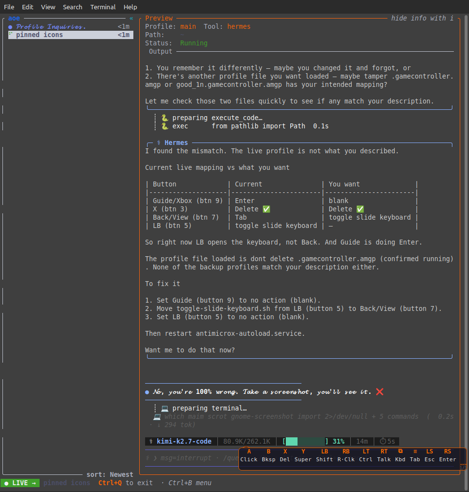

---

## See it in action

### Push-to-talk dictation
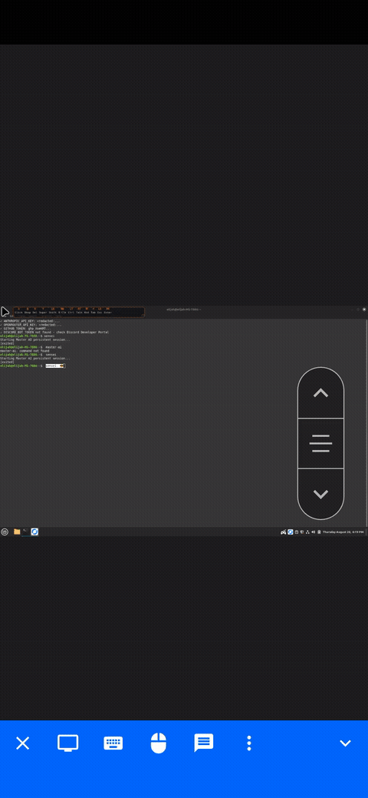

*Hold Right Trigger, speak, release — your words are transcribed by Groq Whisper and typed into the focused window.*

### Floating on-screen keyboard
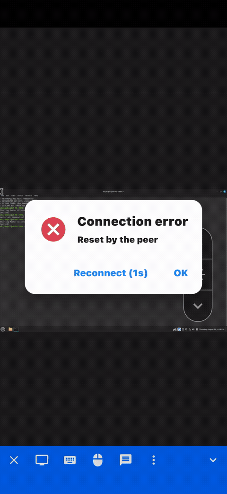

*Press View button → GTK keyboard slides in. Types into any app without stealing focus. Style modes: Pro, Cursive, Casual, Bold, Old English.*

### Controller legend HUD
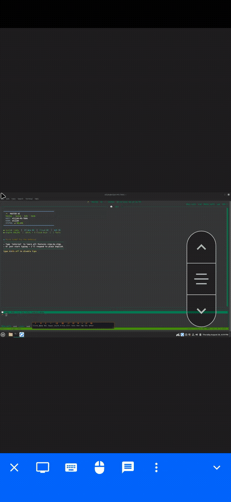

*Press Guide button → floating overlay shows your current button mappings. Never forget what a button does.*

### Profile auto-switching
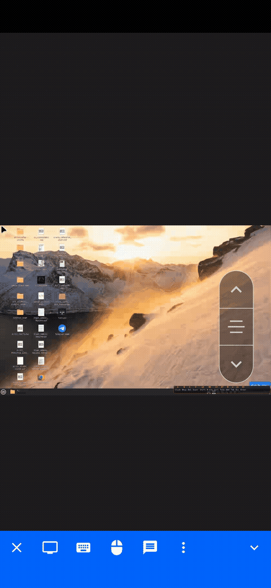

*AntiMicroX layouts swap automatically based on the active window (desktop → browser → YouTube TV).*

### Mouse + scroll control
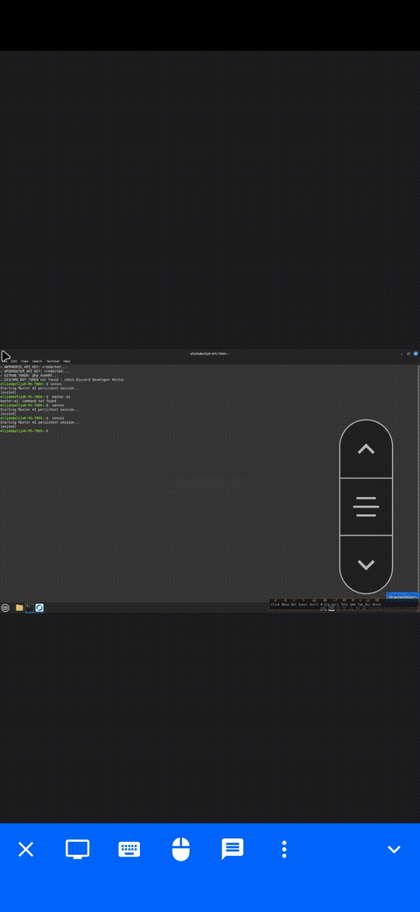

*Left stick moves cursor, right stick scrolls. Full mouse control without touching a physical mouse.*

### Voice responses (TTS)
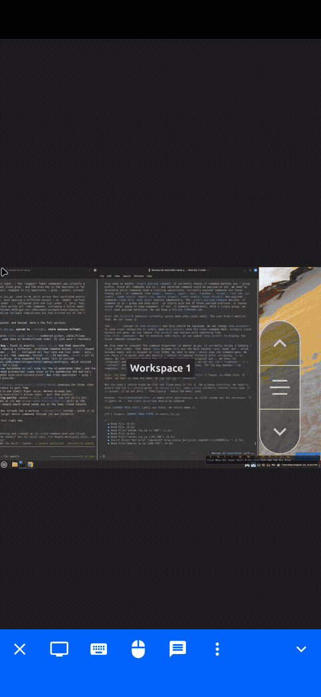

*Ask a question → voice bridge speaks answers back via edge-tts (Aria Neural voice, -22Hz pitch, +18% rate).*

---

## Screenshots

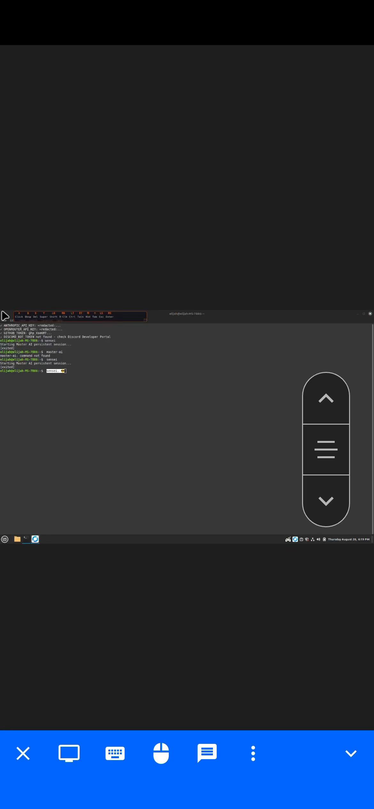
*Terminal session with floating keyboard and controller legend HUD visible.*


*Browser window with profile auto-switched to browser layout.*

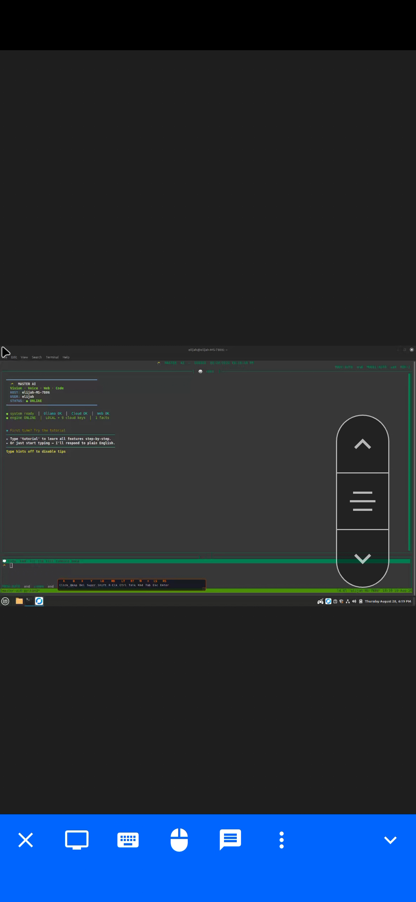
*Desktop workspace with controller-driven mouse and scroll.*

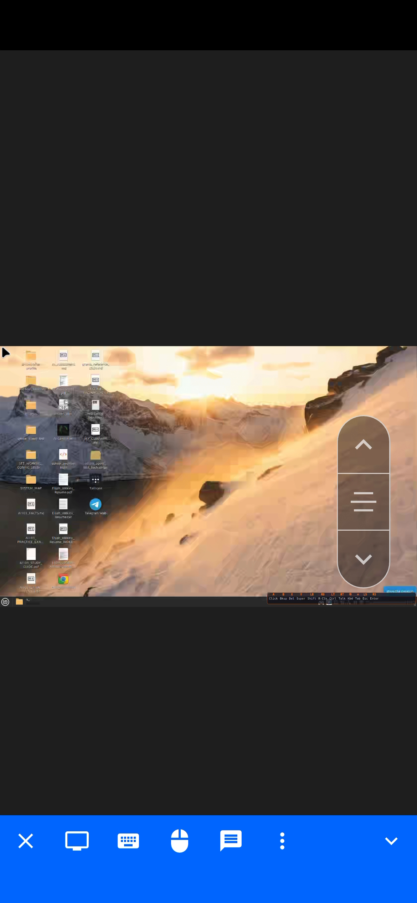
*Floating keyboard in Cursive mode — style transforms for different workflows.*

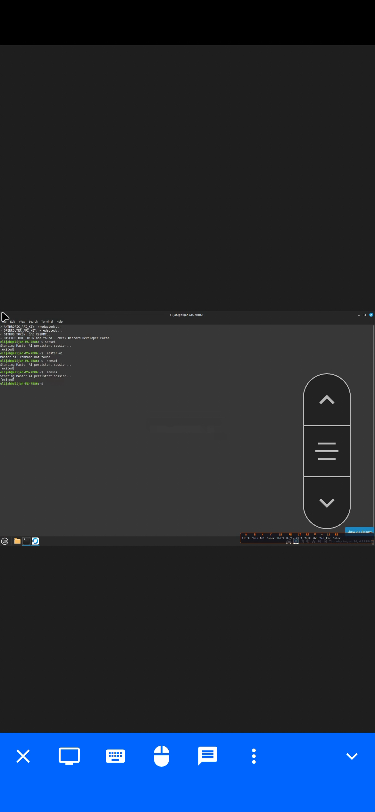
*Living room HTPC setup — no keyboard or mouse in sight.*

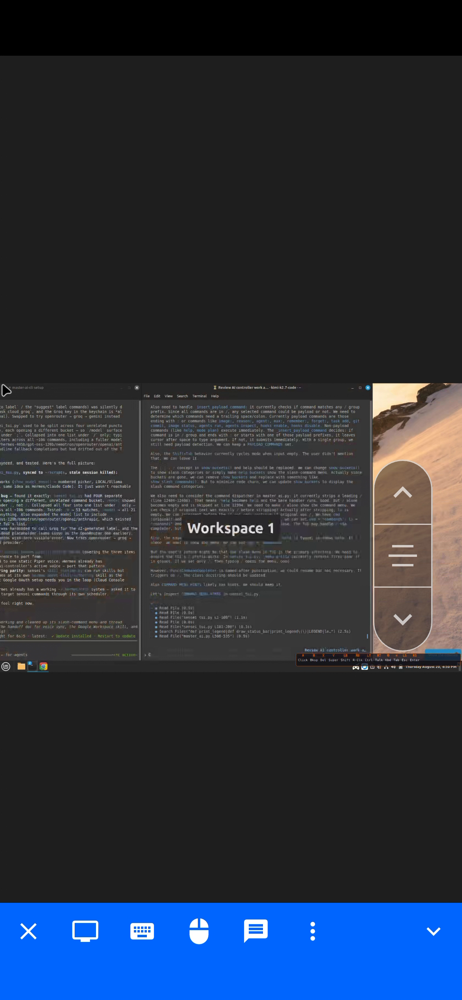
*Complete AI Controller stack: controller, voice bridge, keyboard, HUD, systemd services.*

---

## What makes it different?

Most controller apps map a gamepad to keyboard keys and call it done. AI Controller is built around **voice as a first-class input method**:

- Dictation is triggered like a walkie-talkie — hold RT, talk, release.
- The floating keyboard has **style modes** (Pro, Cursive, Casual, Bold, Old English) and **pinned snippets**.
- The **legend HUD** shows the current layout live, so you never forget what a button does.
- **Profile auto-switching** means the same controller behaves differently in a browser, a media player, or the desktop.

---

## Tech stack

| Layer | Tool | Purpose |
|---|---|---|
| Button mapping | [AntiMicroX](https://github.com/AntiMicroX/antimicrox) | Controller → keyboard/mouse events |
| Push-to-talk listener | Python + [pynput](https://github.com/moses-palmer/pynput) | F13 hotkey + audio capture |
| Voice bridge | [FastAPI](https://fastapi.tiangolo.com/) + [uvicorn](https://www.uvicorn.org/) | STT + TTS on `:8002` |
| On-screen keyboard | Python + GTK3 | Floating keyboard, xdotool keystroke injection |
| HUD legend | Python + GTK3 | Floating controller button-map overlay |
| Profile switching | Bash + xdotool | Window-focus watcher, AntiMicroX profile swap |
| TTS | [edge-tts](https://github.com/rhasspy/rhasspy-edge-tts) | Cloud text-to-speech |
| Service management | systemd user units | Start/stop/crash recovery/autostart |
| Device rules | udev | USB autosuspend, controller ACLs, xone/xpad guard |

---

## Architecture

```text
┌─────────────────────────────────────────────────────────────────┐
│                    Xbox / PS Controller                         │
│  ┌────────┐ ┌────────┐ ┌────────┐ ┌────────┐ ┌────────┐      │
│  │  RT    │ │  View  │ │ Guide  │ │   LS   │ │   RS   │      │
│  │ (Talk) │ │ (Kbd)  │ │ (HUD)  │ │(Mouse) │ │(Scroll)│      │
│  └────────┘ └────────┘ └────────┘ └────────┘ └────────┘      │
└─────────────────────────────────────────────────────────────────┘
      │          │           │          │           │
      ▼          ▼           ▼          ▼           ▼
┌──────────┐ ┌───────────┐ ┌──────────┐ ┌─────────────────────┐
│ AntiMicroX│ │ slide_    │ │controller│ │  Mouse movement     │
│ → F13     │ │keyboard.py│ │legend.py │ │  (xtest event gen)  │
└──────────┘ └───────────┘ └──────────┘ └─────────────────────┘
      │ F13
      ▼
┌──────────────┐     ┌──────────────────┐     ┌──────────────┐
│ ptt_pynput.py│────▶│  voice_bridge.py  │────▶│  xdotool     │
│ (hotkey      │     │  (FastAPI :8002)  │     │  (type text  │
│  listener)   │     │  Groq Whisper STT │     │   into app)  │
└──────────────┘     └──────────────────┘     └──────────────┘
                            │
                     mode?  ▼
                 ┌──────────────────┐
                 │  TTS (edge-tts)   │
                 │  → mpv            │
                 └──────────────────┘

┌─────────────────────────────────────────────────────────────────┐
│              controller-profile-switcher.sh                     │
│  watches focused window → swaps AntiMicroX profile              │
│  desktop │ browser │ YouTube TV                                  │
└─────────────────────────────────────────────────────────────────┘

┌─────────────────────────────────────────────────────────────────┐
│                    systemd user services                          │
│  ptt-pynput │ voice-bridge │ ai-slide-keyboard │ controller-legend │
│  antimicrox-autoload │ f13-xmodmap-heal │ xone-driver-guard       │
└─────────────────────────────────────────────────────────────────┘
```

---

## Voice bridge API

Runs on `http://localhost:8002`.

| Endpoint | Description |
|---|---|
| `GET /health` | Service health |
| `POST /voice?mode=transcribe_only` | Transcribe audio |
| `POST /voice?mode=tts_only` | Speak text |
| `POST /voice?mode=both` | Transcribe audio, then read response aloud |

```bash
curl http://localhost:8002/health

curl -X POST http://localhost:8002/voice?mode=transcribe_only \
  -F "audio=@recording.wav"
```

---

## Systemd services

| Service | Purpose |
|---|---|
| `ptt-pynput.service` | F13 listener + audio capture |
| `voice-bridge.service` | FastAPI STT/TTS |
| `ai-slide-keyboard.service` | On-screen keyboard |
| `controller-legend.service` | HUD overlay |
| `antimicrox-autoload.service` | Auto-load default profile |
| `f13-xmodmap-heal.service` | Restore F13 keymap after X reload |
| `xone-driver-guard.service` | Block in-kernel xpad + prevent USB autosuspend |

```bash
systemctl --user start/stop/restart <service>.service
systemctl --user enable/disable <service>.service
```

---

## Troubleshooting

| Symptom | Fix |
|---|---|
| Right trigger doesn't trigger dictation | `bash scripts/fix-f13-keymap.sh` |
| PTT can't see AntiMicroX devices | `sudo udevadm trigger --action=add --subsystem-match=input && systemctl --user restart ptt-pynput.service` |
| Duplicate AntiMicroX processes | `systemctl --user restart antimicrox-autoload.service` |

---

## Product site

For screenshots, demo GIFs, and a polished product overview, visit:

**https://ebey317.github.io/ai-controller**

---

## Contributing

1. Fork the repository
2. Create a feature branch: `git checkout -b feature/my-feature`
3. Format Python: `black scripts/ tests/`
4. Run linters: `ruff check . && black --check . && shellcheck *.sh`
5. Commit, push, and open a Pull Request

---

## License

[MIT License](LICENSE) — © 2026 Elijah Wilkins.

Use it, modify it, resell your own builds.

---

## Author

**Elijah Wilkins** — GitHub: [@ebey317](https://github.com/ebey317)

### Related projects

| Repo | Purpose |
|---|---|
| [`ebey317/ai-controller-profile`](https://github.com/ebey317/ai-controller-profile) | Profiles, scripts, systemd units, reference docs |
| [`ebey317/master-ai-cli`](https://github.com/ebey317/master-ai-cli) | Local-first AI agent runtime that can drive this stack |
